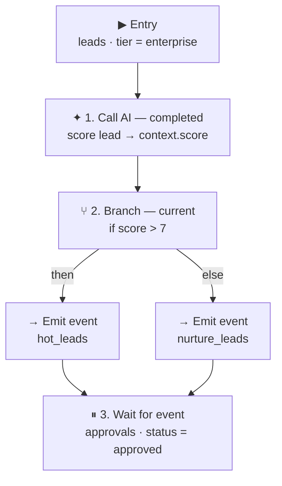

A **workflow** is a project-scoped, multi-step process that starts when a record lands in its _entry dataset_. Steps run in order, share a JSON _context_ scratchpad seeded from the entry record, and can emit events, call AI, branch on a condition, wait for other events, or sleep. You compose pipelines like _lead → AI score → branch on score → notify → wait for approval → follow up_ without running your own queue or state store.

## Build it visually

Every workflow is edited through **the same definition in three interchangeable views** — pick whichever fits the moment, and switch anytime without losing anything.

| Mode | What it's for |
| --- | --- |
| **Canvas** | A true drag-and-drop, box-and-wire editor. Every step type sits in a toolbox; branch renders as a native switch with labeled then/else lanes you drop steps straight into. Undo, a control bar, and a per-step property panel — all self-hosted, zero third-party script calls. |
| **Form** | Structured step cards with typed fields per step type — dataset autocomplete, an AI-agent dropdown, a reusable condition-row builder (path / operator / value). Reorder by drag or ↑/↓. Validated client-side before you even hit save. |
| **JSON** | The full-fidelity raw definition, for anything the form doesn't cover yet. Always available — switching modes round-trips losslessly, so you're never locked out of a workflow someone else built in JSON. |

## See the whole flow at a glance

Every workflow — and every running _instance_ of it — renders as a diagram, not just a list of steps. A `branch` step expands into labeled `then`/`else` lanes right where it sits, so the decision tree is visible without opening the editor. Below is the shape of the lead-qualification workflow from the JSON example further down:



This is the same diagram whether you're looking at the workflow's definition or a live, running instance — running instances recolor each node from execution history: completed, current, waiting, failed (with the error inline), or not yet reached.

## Branching

A `branch` step evaluates one or more conditions against the instance context — the same condition shape used everywhere else in Hookie (`equals · not_equals · contains · exists · gt · lt`) — and runs `then` when they match, `else` otherwise. Because conditions read the context, you can branch on _anything an earlier step produced_: score a lead with AI, then route high-scorers one way and everyone else another. Branches nest up to **3 levels deep**, and every taken path is recorded in step history so you can see exactly which way an instance went.

Branch sub-steps run _synchronously_ — `emit_event`, `call_ai`, `agent_call`, and nested `branch` only. A `delay` or `wait_for_event` can't sit inside a branch; put it after the branch instead. This keeps a branch's execution atomic and its outcome immediately visible in the diagram.

### Branching on an AI answer

`gt` and `lt` compare numbers, and a model replies with text — so what a `call_ai` or `agent_call` step puts in the context matters. A reply that _is_ a JSON value is stored as that value; anything else is stored as the text the model wrote. So `"8"` becomes the number `8` and `{"score": 8, "reason": "…"}` becomes an object, while `"Looks like a good fit"` stays a string.

That gives you two shapes that work, and it is worth picking one deliberately:

- **Ask for the bare value** — "reply with the number only" with `"output_key": "score"`, then branch on `{ "path": "score", "op": "gt", "value": 7 }`. That is the example above.
- **Ask for an object** — "reply with JSON: score and reason" with `"output_key": "ai"`, then branch on `{ "path": "ai.score", "op": "gt", "value": 7 }`. Conditions take dotted paths, so the reason travels with the score and both are visible in the instance context.

What does _not_ work is asking for JSON and then branching on the `output_key` itself — `path: "score"` would resolve to the whole object, and a numeric comparison against an object is false. A branch whose condition can never hold isn't an error; it just takes `else` every time. The instance context is shown in full on the instance drill-down — check there first when a branch always goes the same way.

`output_dataset` is unaffected by any of this: it always records the model's reply as the text it actually wrote, so the audit trail is what was said, not what was inferred from it.

## Defining a workflow

Create workflows in the console under **Project → Workflows** — start in Canvas, Form, or JSON, whichever you reach for first. Entry conditions use the shared condition shape — an empty array matches every record in the dataset.

```json
{
  "name": "Lead qualification",
  "entry_dataset": "leads",
  "entry_conditions": [
    { "path": "tier", "op": "equals", "value": "enterprise" }
  ],
  "steps": [
    { "type": "call_ai",
      "instructions": "Score this lead 1-10 for ICP fit. Reply with the number only.",
      "output_key": "score", "output_dataset": "lead_qualification" },
    { "type": "branch",
      "conditions": [{ "path": "score", "op": "gt", "value": 7 }],
      "then": [
        { "type": "emit_event", "dataset": "hot_leads", "payload": { "priority": "high" } }
      ],
      "else": [
        { "type": "emit_event", "dataset": "nurture_leads" }
      ] },
    { "type": "wait_for_event",
      "dataset": "approvals",
      "conditions": [{ "path": "status", "op": "equals", "value": "approved" }],
      "timeout_seconds": 86400 },
    { "type": "delay", "seconds": 3600 }
  ]
}
```

## Step types

| Type | What it does |
| --- | --- |
| `emit_event` | Write a record into a dataset (entry context merged with an optional payload) and enqueue signed deliveries for it. Emitted records never re-trigger workflow entry — no feedback loops. |
| `call_ai` | Run an AI prompt over the instance context. The reply lands in the context under output_key (default ai_result) — as a number or object if the model replied with one, so a later branch can compare it — and, verbatim as text, in output_dataset. |
| `agent_call` | Invoke a reusable AI agent by id — its model, system prompt, and memory dataset apply. The result lands under output_key (default agent_result), interpreted the same way call_ai's is. |
| `branch` | Conditional if/then/else. Evaluate conditions against the instance context and run the matching then or else sub-sequence — including branching on an earlier call_ai or agent_call result. Branches can nest up to 3 levels deep. |
| `wait_for_event` | Suspend until a record matching the conditions arrives in a dataset. An optional timeout_seconds moves the instance to timed_out if nothing arrives. |
| `delay` | Suspend for N seconds before the next step. |

## AI agents

An **AI agent** is a reusable, named LLM persona — a model, a system prompt, a bounded token cap, and an optional _memory dataset_ that every output is also written to for recall. Define agents next to your workflows in the console, then reference one from any workflow with an `agent_call` step — including inside a branch. Update the agent once; every workflow that uses it picks up the change.

## Instances & observability

Each matching entry record starts an **instance**. The console lists instances per workflow with a drill-down into the live context, the recolored progress diagram, and a per-step history (started / completed / failed, including which branch was taken), so you can see exactly where a flow is and why it stopped.

| State | Meaning |
| --- | --- |
| `pending` | Created from a matching entry record; about to run. |
| `running` | Executing steps. |
| `waiting` | Suspended on a delay or wait_for_event. |
| `completed` | Every step finished. |
| `failed` | A step errored; last_error records why. |
| `timed_out` | A wait_for_event passed its deadline. |

## Limits

- Up to **32 steps** per workflow (branch sub-steps count toward the total).
- Branch nesting depth: **3** levels.
- Active-instance cap per plan: **25** on Free, **500** on Pro, **2,000** on Team.
- `delay` and `wait_for_event` timeouts resolve on the platform scheduler (~5-minute resolution).
- AI steps are bounded to 1,024 output tokens per step. (The monthly AI run quota applies to AI triggers, not to workflow steps.)

Workflows are managed from the console — [sign in](https://app.hookie.ai/) and open a project's **Workflows** tab. For end-to-end patterns, see the [use cases](https://hookie.ai/use-cases).
